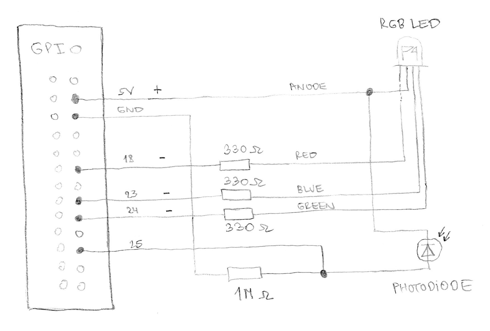
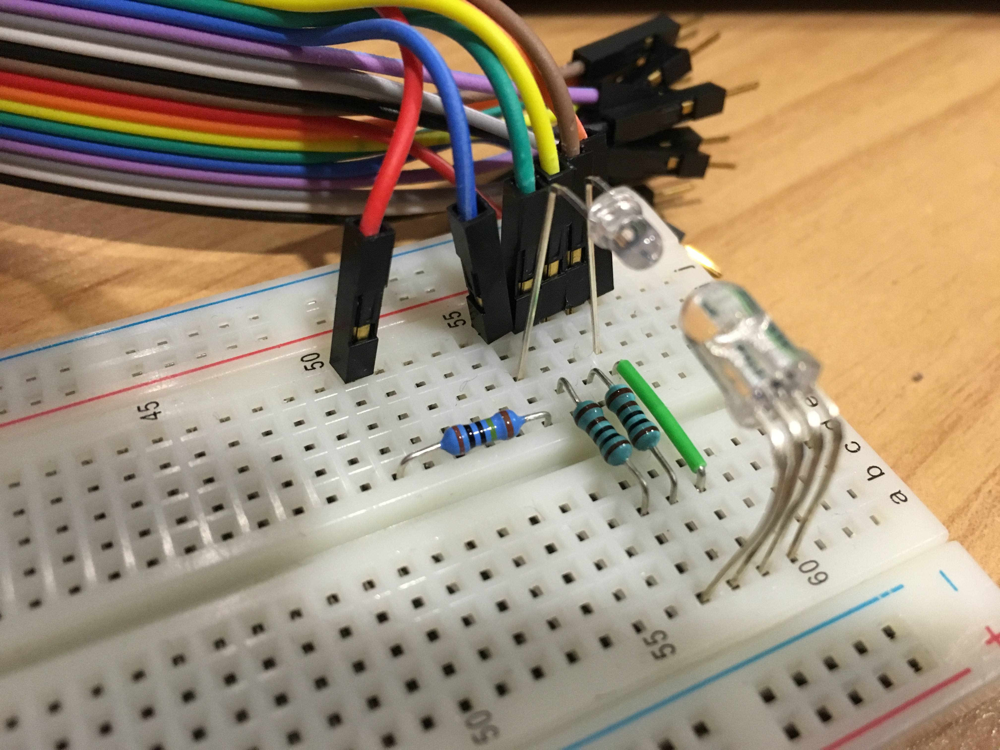
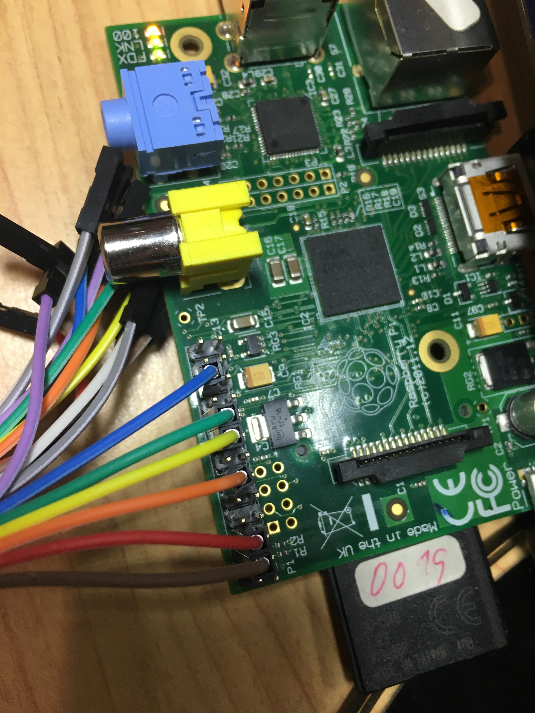

# Morse code communication between LED and phototransistor on Raspberry Pi 1

## Programs:
* MorseCodeWriter - Morse code visualisation on LED (RGB)
* MorseCodeReader - Reading morse code with phototransistor from LED (RGB)

## Circuit diagram:

## Photos of wiring:

